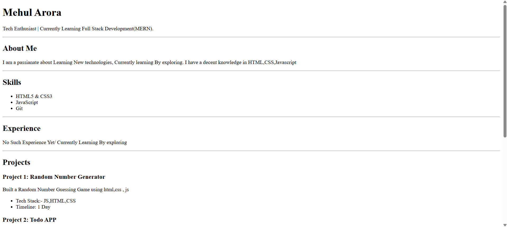
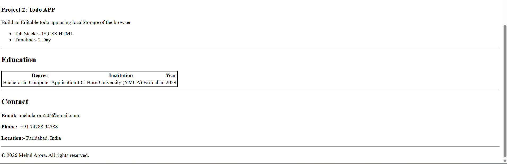

# HTML Resume Template
This repo contains my resume built using simple html and css

## What To Do to get start?
Follow these steps to run the project locally.

1. Clone the repository:
   ```bash
   git clone https://github.com/MEHULARORA11/Resume.git
   ```
2. Navigate to the project directory:
   ```bash
   cd html-resume
   ```
3. Open the `index.html` file in your web browser to view the resume template.

## Screenshots

